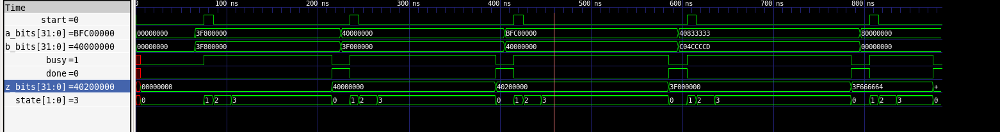

# FP32_ADDER_DRIVER_DOC.md
# FP32 FSM-Based Serial Floating-Point Adder  
## Design Methodology and Usage Guide

---

## 1. Design Goal

The goal of this design is to provide a **fully IEEE-754 compliant
single-precision (FP32) floating-point addition unit** that can be used as a
**golden reference** for verification and validation.

Key objectives:
- Correct handling of all IEEE-754 special cases:
  - NaN
  - ±Infinity
  - ±Zero
  - Denormal numbers
- Bit-accurate results with deterministic behavior
- Clear and verifiable control flow suitable for debugging and education

---

## 2. Architectural Overview

The design consists of two layers:

### 2.1 Core Adder (`adder.sv`)
- FSM-based serial IEEE-754 FP32 floating-point adder
- Uses low-level **stb/ack handshake** for inputs and output
- Processes **one operation at a time**
- Variable latency depending on data values

### 2.2 Driver Wrapper (`fp_adder_driver.sv`)
- Wraps the core adder
- Converts stb/ack handshakes into a simple:
  - `start / busy / done` interface
- Intended to simplify integration with higher-level control logic

---

## 3. FSM-Based Serial Design Philosophy

### 3.1 Why FSM-Based Serial Design

This adder prioritizes **correctness and clarity** over throughput.

Reasons for choosing a serial FSM approach:
- Easier to reason about IEEE-754 corner cases
- Straightforward mapping from the IEEE-754 algorithm to RTL states
- Deterministic and reproducible behavior
- Ideal as a reference model for verifying faster or approximate FP units

---

## 4. Core Adder Algorithm (High-Level Flow)

The internal FSM of the core adder follows this sequence:

1. **Input acquisition**
   - Receive operand A
   - Receive operand B

2. **Unpack**
   - Extract sign, exponent, and mantissa
   - Remove exponent bias
   - Extend mantissa with Guard / Round / Sticky (GRS) bits

3. **Special case handling**
   - NaN propagation
   - Infinity handling
   - Zero detection
   - Denormal adjustment

4. **Exponent alignment**
   - Align exponents using 1-bit right shift per cycle
   - Accumulate sticky bits

5. **Mantissa add/subtract**
   - Add or subtract based on operand signs
   - Select result sign by magnitude comparison

6. **Normalization**
   - Left-shift normalization (1 bit per cycle)
   - Handle subnormal results if required

7. **Rounding**
   - Round-to-nearest-even using GRS bits

8. **Pack**
   - Reassemble IEEE-754 FP32 result
   - Handle overflow and exact zero sign correction

---

## 5. Driver Design Methodology

### 5.1 Purpose of the Driver

The core adder uses a low-level handshake interface that is inconvenient for
most control logic.  
The driver provides a **clean transaction-level abstraction**.

### 5.2 Driver FSM States

The driver FSM consists of four states:

| State   | Description |
|--------|-------------|
| IDLE   | Waiting for a start request |
| SEND_A | Send operand A via stb/ack |
| SEND_B | Send operand B via stb/ack |
| WAIT_Z | Wait for result Z |

---

### 5.3 Start / Busy / Done Semantics

- **start**
  - Sampled only when `busy == 0`
  - Recommended as a one-cycle pulse

- **busy**
  - High whenever the driver FSM is not in IDLE
  - Indicates an operation is in progress

- **done**
  - Sticky level signal
  - Asserted when result becomes available
  - Cleared only when a new start is accepted

---
## 6. Figure

## 7. Recommended Operation Sequence

1. Wait until `busy == 0`
2. Provide valid `a_bits` and `b_bits`
3. Assert `start` for one clock cycle
4. Wait until `done == 1`
5. Read `z_bits`
6. Repeat for the next operation

This protocol guarantees:
- No lost transactions
- No race conditions
- Simple integration with FSM-based controllers

---

## 8. Latency Characteristics

- The design processes **one operation at a time**
- Latency is **data-dependent** and varies with:
  - Exponent difference during alignment
  - Number of leading zeros during normalization
- No fixed-cycle guarantee

This behavior is intentional and acceptable for a golden reference model.

---

## 9. Intended and Non-Intended Use Cases

### Suitable for
- Golden reference computation
- Verification of high-performance FP adders
- Educational and research projects
- Control-dominated datapaths

### Not suitable for
- Softmax / Attention inner loops
- AI accelerator arithmetic cores
- High-throughput or low-latency datapaths

---

## 10. Design Philosophy Summary

This FP32 adder is designed with the following priorities:

1. **Correctness first**
2. **Clarity over performance**
3. **Explicit state transitions**
4. **Ease of verification and debugging**

It is intended to serve as a **reference implementation**, not a production
datapath element for performance-critical systems.

## FSM-Based IEEE-754 Single-Precision Floating-Point Adder (FP32 Serial Adder)

> Source: IEEE-754 single-precision floating-point adder by Jonathan P. Dawson (2013)  
> Characteristics: FSM-based, single-operation-at-a-time, variable latency, strict IEEE-754 compliance

---

## 1. Module Positioning and Intended Use

This module is an **FSM-based IEEE-754 single-precision floating-point adder (FP32 Adder)**.
It is typically wrapped by a driver module (e.g. `fp_adder_driver`) to simplify usage.

### Advantages
- Fully compliant with IEEE-754 (NaN / ±Infinity / ±0 / Denormal)
- Complete exponent alignment, normalization, and GRS rounding
- Deterministic behavior, suitable as a golden reference

### Disadvantages
- Extremely low throughput (one operation at a time)
- Variable and potentially large latency
- Not suitable for Softmax / Attention / GEMM

---

## 2. Interface and Handshake Protocol

### Input A
- `input_a[31:0]`
- `input_a_stb`
- `input_a_ack`

### Input B
- `input_b[31:0]`
- `input_b_stb`
- `input_b_ack`

### Output Z
- `output_z[31:0]`
- `output_z_stb`
- `output_z_ack`

---

## 3. IEEE-754 FP32 Format

31      30         23  22                     0  
+--+----------+-------------------------------+  
|S | Exponent | Fraction (Mantissa)           |  
+--+----------+-------------------------------+  

bias = 127

---

## 4. FSM States

get_a → get_b → unpack → special_cases → align → add_0 → add_1  
→ normalise_1 → normalise_2 → round → pack → put_z → get_a

---

## 5. Latency Characteristics

- Alignment: 1-bit per cycle
- Normalization: 1-bit per cycle
- Throughput: very low

---

## 6. Suitability

Best used as:
- Golden reference
- Verification model
- Educational FPU

Not suitable for:
- AI datapaths
- Softmax / Attention hardware

---

## Appendix

IEEE Floating Point Adder (Single Precision)  
Copyright (C) Jonathan P. Dawson 2013

// 2013-12-12

